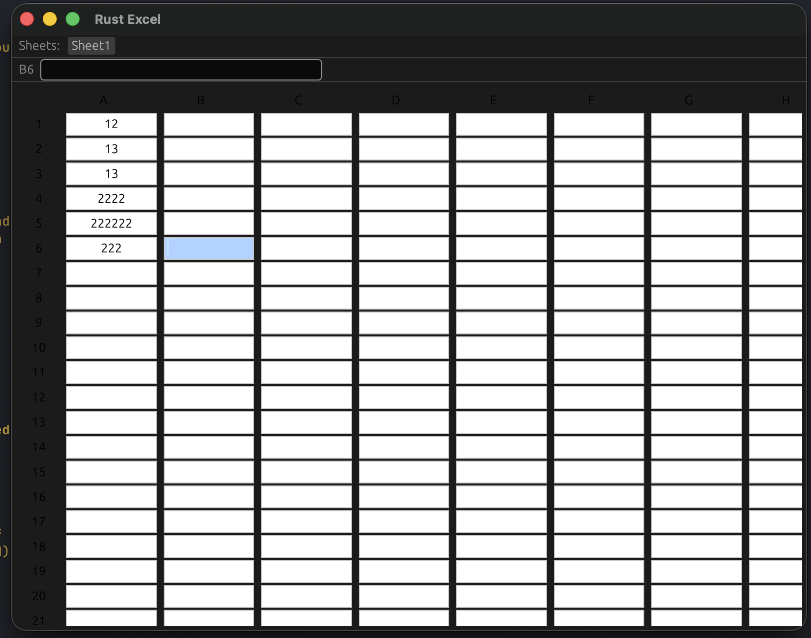

# Rust Excel (Excel Engine in Rust)

A lightweight Excel-like spreadsheet application built in Rust using **egui + eframe**.

## Features

- Excel-style grid UI
- Cell selection & editing
- Single-click select, Excel-like edit behavior
- Formula engine (basic support)
- Real-time recalculation
- Keyboard navigation (Arrow keys, Enter, Esc, F2)
- Formula bar
- JSON persistence (save/load)
- Modular architecture (engine + UI)

## UI




## Requirements

- Rust (stable) >= 1.70
- Cargo

## Run the Application

```bash
cargo run
```

## Build Release Binary

```bash
cargo build --release
```

## Controls

| Action | Key |
|--------|------|
| Select cell | Click |
| Edit cell | Click selected cell / F2 |
| Commit edit | Enter |
| Cancel edit | Esc |
| Move selection | Arrow keys |

## Notes

This project is a learning-focused Excel engine written in Rust.
It demonstrates UI architecture, parsing, evaluation, and spreadsheet state management.

## License

MIT
